# AWS Architecture Overview
## Writlix Social Spark Hub - Modern Serverless Architecture

**Version:** 1.0  
**Date:** January 11, 2025  
**Target Cost:** <$100/month  

---

## Architecture Philosophy

The new AWS architecture follows modern serverless principles with a focus on:
- **Cost Optimization:** Leveraging free tiers and pay-per-use services
- **Scalability:** Auto-scaling based on demand
- **Security:** Enterprise-grade authentication and data protection
- **Maintainability:** Simplified deployment and monitoring
- **Performance:** Optimized for low latency and high availability

---

## High-Level Architecture Diagram

```mermaid
graph TB
    %% User Layer
    User[👤 Users] --> CF[☁️ CloudFront CDN<br/>Global Distribution]
    
    %% Frontend Layer
    CF --> S3Frontend[📦 S3 Static Hosting<br/>React SPA Build]
    S3Frontend --> Clerk[🔐 Clerk Auth<br/>B2C + OAuth]
    
    %% API Layer
    S3Frontend --> APIGw[🚪 API Gateway<br/>REST + Authentication]
    
    %% Authentication Flow
    Clerk --> OAuth[🔗 OAuth Providers<br/>Google, LinkedIn, FB, IG]
    Clerk --> Webhooks[📬 Clerk Webhooks]
    Webhooks --> APIGw
    
    %% Serverless Functions
    APIGw --> Lambda1[⚡ OAuth Functions<br/>FB/IG/LinkedIn]
    APIGw --> Lambda2[⚡ Content Generation<br/>OpenAI Integration]
    APIGw --> Lambda3[⚡ Social Posting<br/>Scheduled & Instant]
    APIGw --> Lambda4[⚡ Subscription<br/>Stripe Integration]
    APIGw --> Lambda5[⚡ Utility Functions<br/>Validation, Settings]
    
    %% Data Layer
    Lambda1 --> RDS[(🗄️ RDS PostgreSQL<br/>db.t3.micro)]
    Lambda2 --> RDS
    Lambda3 --> RDS
    Lambda4 --> RDS
    Lambda5 --> RDS
    
    %% Storage Layer
    Lambda2 --> S3Storage[📦 S3 Bucket<br/>AI Images & Assets]
    Lambda3 --> S3Storage
    
    %% External Integrations
    Lambda1 --> SocialAPIs[🌐 Social Media APIs<br/>Facebook, Instagram, LinkedIn]
    Lambda2 --> OpenAI[🤖 OpenAI API<br/>GPT-4o Content Generation]
    Lambda3 --> SocialAPIs
    Lambda4 --> Stripe[💳 Stripe<br/>Payment Processing]
    Lambda5 --> reCAPTCHA[🛡️ Google reCAPTCHA]
    
    %% Monitoring & Logging
    Lambda1 --> CW[📊 CloudWatch<br/>Logs & Monitoring]
    Lambda2 --> CW
    Lambda3 --> CW
    Lambda4 --> CW
    Lambda5 --> CW
    RDS --> CW
    CF --> CW
    
    %% Security
    APIGw --> IAM[🔒 IAM Roles<br/>& Policies]
    Lambda1 --> IAM
    Lambda2 --> IAM
    Lambda3 --> IAM
    Lambda4 --> IAM
    Lambda5 --> IAM
    S3Frontend --> IAM
    S3Storage --> IAM
    
    %% Cost Optimization
    subgraph "💰 Cost Optimization"
        FreeTier[Free Tier Services:<br/>• Lambda: 1M requests/month<br/>• RDS: 750 hours/month<br/>• S3: 5GB storage<br/>• API Gateway: 1M requests/month<br/>• CloudFront: 1TB transfer/month]
    end
    
    %% Styling
    classDef userLayer fill:#e1f5fe
    classDef frontendLayer fill:#f3e5f5
    classDef apiLayer fill:#fff3e0
    classDef computeLayer fill:#e8f5e8
    classDef dataLayer fill:#fff8e1
    classDef externalLayer fill:#fce4ec
    
    class User,CF userLayer
    class S3Frontend,Clerk frontendLayer
    class APIGw,Webhooks apiLayer
    class Lambda1,Lambda2,Lambda3,Lambda4,Lambda5 computeLayer
    class RDS,S3Storage dataLayer
    class OAuth,SocialAPIs,OpenAI,Stripe,reCAPTCHA externalLayer
```



---

## Component Details

### 1. Frontend Layer
**React Single Page Application**
- **Hosting:** Amazon S3 static website hosting with CloudFront CDN
- **Global Distribution:** CloudFront CDN for worldwide performance
- **Authentication:** Clerk React SDK integration
- **API Communication:** RESTful API calls to API Gateway endpoints
- **Cost:** ~$1-8/month (S3 storage + CloudFront distribution)

**Key Features:**
- Responsive design with shadcn/ui components
- Real-time authentication state management
- Optimized bundle size for faster loading
- Progressive Web App capabilities

### 2. Authentication Layer
**Clerk Authentication Service**
- **User Management:** Complete user lifecycle management
- **OAuth Integration:** Google, LinkedIn, Facebook, Instagram
- **Security Features:** MFA, session management, user verification
- **Webhooks:** Real-time user event notifications
- **Cost:** $25/month for up to 10,000 monthly active users

**Replaced Supabase Features:**
- Custom authentication flows
- User profile management
- Session recovery mechanisms
- OAuth callback handling (partially)

### 3. API Layer
**Amazon API Gateway**
- **Type:** REST API with Lambda proxy integration
- **Authentication:** Clerk JWT verification
- **Features:** Request/response transformation, throttling, caching
- **Cost:** $3.50 per million API calls (first 1M free)

**Endpoints:**
- `/auth/*` - Authentication callbacks and user management
- `/content/*` - Content generation and management
- `/social/*` - Social media operations
- `/subscription/*` - Payment and subscription management

### 4. Compute Layer
**AWS Lambda Functions**

**Function Categories:**

1. **OAuth Handlers (4 functions)**
   - `facebook-oauth-handler` - Facebook token exchange
   - `instagram-oauth-handler` - Instagram business account setup
   - `linkedin-oauth-handler` - LinkedIn profile/company pages
   - `oauth-callback-router` - Universal OAuth callback processing

2. **Content Generation (2 functions)**
   - `generate-content` - OpenAI GPT-4o-mini integration
   - `generate-content-from-image` - AI vision content creation

3. **Social Media Posting (6 functions)**
   - `post-to-facebook` & `post-to-facebook-direct`
   - `post-to-instagram` & `post-to-instagram-direct`
   - `post-to-linkedin` & `post-to-linkedin-direct`

4. **Business Logic (3 functions)**
   - `subscription-handler` - Stripe integration for payments
   - `schedule-manager` - Post scheduling logic
   - `utility-functions` - Validation, settings, cleanup

**Optimization Configuration:**
- **Memory:** 128MB-512MB (function-specific)
- **Timeout:** 15-30 seconds (API-dependent)
- **Runtime:** Node.js 18.x
- **Cost:** ~$0-20/month (likely free tier)

### 5. Data Layer

**Amazon RDS PostgreSQL**
- **Instance:** db.t3.micro (1 vCPU, 1GB RAM)
- **Storage:** 20GB GP2 SSD (expandable)
- **Multi-AZ:** Disabled for cost optimization
- **Automated Backups:** 7-day retention
- **Cost:** ~$15-25/month

**Optimized Schema:**
```sql
-- Essential tables only
users_metadata         -- Supplementary user data not in Clerk
content_ideas          -- Generated content storage
scheduled_posts        -- Post scheduling information
social_credentials     -- Encrypted social media tokens
user_subscriptions     -- Payment and subscription status
schedule_settings      -- User scheduling preferences
```

**Amazon S3 Storage**
- **Frontend Bucket:** Static website hosting for React SPA
- **Assets Bucket:** AI-generated images, user uploads, temporary files
- **Features:** Lifecycle policies, intelligent tiering, CDN integration
- **Cost:** ~$1-5/month for storage + ~$2-5/month for CloudFront

### 6. External Integrations

**Preserved Integrations:**
- **OpenAI API:** Content generation (GPT-4o-mini, GPT-4o with vision)
- **Social Media APIs:** Facebook Graph v18.0, Instagram, LinkedIn v2
- **Stripe:** Payment processing and subscription management
- **Google reCAPTCHA:** Bot protection and validation

**Integration Patterns:**
- Secure credential storage in RDS with encryption
- Token refresh mechanisms in Lambda functions
- Error handling and retry logic for API failures
- Rate limiting compliance for each platform

---

## Security Architecture

### Authentication & Authorization
**Multi-Layer Security:**
1. **Clerk Authentication:** JWT tokens with automatic refresh
2. **API Gateway:** Request validation and rate limiting
3. **IAM Roles:** Least-privilege access for Lambda functions
4. **RDS Security:** VPC isolation, encryption at rest

### Data Protection
**Encryption Strategy:**
- **In Transit:** TLS 1.2+ for all API communications
- **At Rest:** RDS encryption, S3 server-side encryption
- **Application Level:** Social media tokens encrypted with AWS KMS

### Network Security
**VPC Configuration:**
- Lambda functions in private subnets
- RDS in database subnet group
- NAT Gateway for outbound internet access
- Security groups with minimal required access

---

## Cost Breakdown & Optimization

### Monthly Cost Estimate

**Free Tier Benefits (First 12 Months):**
```
AWS Lambda: 1M requests/month = $0
API Gateway: 1M requests/month = $0
RDS: 750 hours/month (db.t3.micro) = $0
S3: 5GB storage + 20K requests = $0
CloudWatch: 10GB logs = $0
```

**Paid Services:**
```
Clerk Authentication: $25/month (up to 10K MAU)
RDS (if exceeding free tier): $15-25/month
S3 Storage: $1-3/month
CloudFront CDN: $2-8/month
Data Transfer: $1-3/month
CloudWatch (additional): $1-3/month
```

**Total Estimated Cost: $45-67/month**

### Cost Optimization Strategies

**Immediate Optimizations:**
- **Reserved Instances:** 1-year RDS reservation for additional savings
- **S3 Lifecycle Policies:** Move old images to cheaper storage classes
- **Lambda Optimization:** Right-size memory allocation based on usage
- **API Gateway Caching:** Reduce backend calls for repeated requests

**Growth-Phase Optimizations:**
- **CloudFront CDN:** Add CDN for global performance and cost reduction
- **DynamoDB Migration:** Consider DynamoDB for specific high-traffic tables
- **Spot Instances:** Use Spot instances for batch processing if needed

**Monitoring & Alerts:**
- **Cost Budgets:** Set up budget alerts at $50, $75, and $100
- **Usage Monitoring:** Track function invocation patterns
- **Performance Metrics:** Optimize based on CloudWatch insights

---

## Scalability & Performance

### Auto-Scaling Architecture
**Lambda Scaling:**
- Automatic scaling from 0 to 10,000+ concurrent executions
- Provisioned concurrency for critical functions to reduce cold starts
- Event-driven architecture for optimal resource utilization

**Database Scaling:**
- Vertical scaling capability (instance size upgrade)
- Read replicas for high-traffic scenarios
- Connection pooling to handle concurrent connections

**Storage Scaling:**
- S3 unlimited storage with automatic lifecycle management
- CloudFront CDN for global content distribution
- Multi-region backup for disaster recovery

### Performance Optimization
**Response Time Targets:**
- API Response: <2 seconds (95th percentile)
- Content Generation: <10 seconds
- Social Media Posting: <5 seconds
- Database Queries: <500ms average

**Optimization Techniques:**
- Lambda function warming for critical paths
- Database query optimization and indexing
- CDN caching for static content
- Efficient API payload design

---

## Monitoring & Observability

### CloudWatch Integration
**Metrics Tracked:**
- Lambda function duration, errors, and invocation count
- API Gateway response times and error rates
- RDS performance metrics and connection count
- S3 request patterns and storage utilization

**Alerting Strategy:**
- Error rate thresholds (>5% error rate)
- Performance degradation alerts
- Cost threshold notifications
- Security anomaly detection

### Logging Architecture
**Structured Logging:**
- Centralized logs in CloudWatch
- JSON-formatted log entries
- Correlation IDs for request tracing
- Sensitive data filtering

---

## Deployment & CI/CD

### Infrastructure as Code
**AWS CloudFormation/CDK:**
- Version-controlled infrastructure definitions
- Environment-specific configurations
- Automated rollback capabilities
- Resource dependency management

### Deployment Pipeline
**Stages:**
1. **Development:** Local testing with AWS SAM
2. **Staging:** Full AWS environment for integration testing
3. **Production:** Blue-green deployment for zero downtime

**Automation:**
- GitHub Actions for CI/CD pipeline
- Automated testing and validation
- Security scanning and compliance checks
- Automated rollback on deployment failures

---

## Migration Benefits Summary

### Cost Benefits
- **40-60% cost reduction** compared to current Supabase setup
- **Predictable scaling costs** with pay-per-use model
- **Free tier maximization** for first year of operation

### Technical Benefits
- **Enhanced security** with Clerk and AWS security services
- **Better scalability** with serverless auto-scaling
- **Improved performance** with optimized architecture
- **Vendor independence** with industry-standard AWS services

### Operational Benefits
- **Simplified authentication** with Clerk's managed service
- **Better monitoring** with CloudWatch integration
- **Automated scaling** without manual intervention
- **Enterprise-grade reliability** with AWS SLAs

---

*This architecture provides a robust, cost-effective foundation for Writlix Social Spark Hub's growth while maintaining all current functionality and improving overall system reliability and performance.*