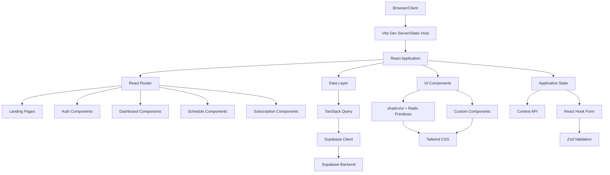
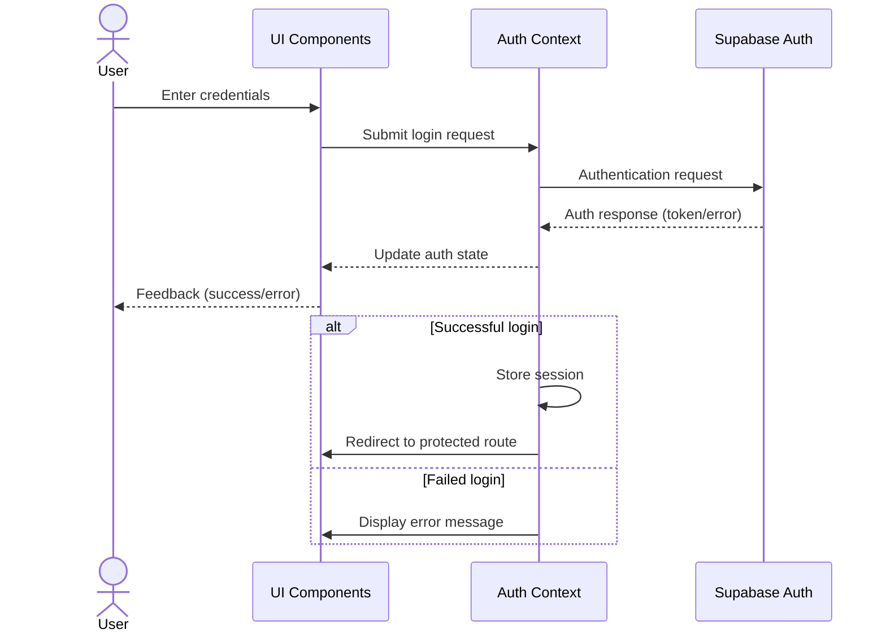

# Writlix Social Spark Hub - Architecture

## Application Structure

## Component Organization

The application follows a feature-based organization pattern:

- `src/components/` - Feature components and UI library
  - `auth/` - Authentication related components
  - `dashboard/` - Dashboard views
  - `data-seed/` - Data seeding utilities
  - `landing/` - Landing page components
  - `layout/` - Layout components (headers, footers, etc.)
  - `previews/` - Content preview components
  - `routes/` - Route definitions
  - `schedule/` - Scheduling components
  - `subscription/` - Subscription management
  - `ui/` - Reusable UI components

## Data Flow

1. User interacts with React components in the browser
2. Components use React Query/TanStack Query for data operations
3. Queries and mutations are executed via the Supabase client
4. Data is retrieved from or stored in Supabase backend services
5. UI updates reflect the new application state

## Authentication Flow

