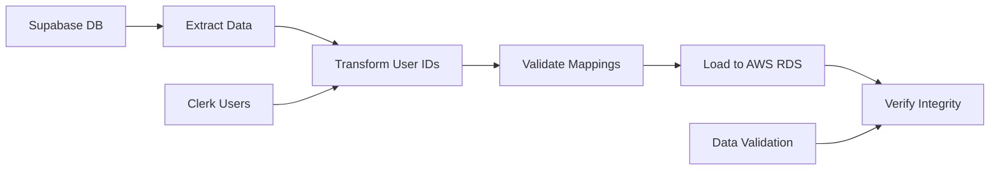

# Migration Strategy and Risk Assessment
## Supabase to AWS Migration - Internal Risk Analysis

**Project:** Writlix Social Spark Hub Migration  
**Risk Assessment Date:** January 11, 2025  
**Reviewed By:** Lead Developer  
**Migration Complexity:** Medium-High  

---

## 1. Migration Strategy Overview

### 1.1 Migration Approach: Blue-Green Deployment

**Strategy Rationale:**
- Minimize downtime during migration
- Allow for quick rollback if issues arise
- Maintain production stability throughout process
- Enable thorough testing before full cutover

**Implementation Plan:**
```
Current State (Blue) → Parallel AWS Environment (Green) → Cutover → Decommission Blue
```

### 1.2 Data Migration Strategy

**Approach:** ETL with User ID Mapping


**Key Principles:**
1. **Data Integrity First:** Comprehensive validation at each step
2. **Incremental Migration:** Migrate in logical chunks (users → content → credentials)
3. **Rollback-Ready:** Maintain ability to revert at any point
4. **Zero Data Loss:** Multiple backup layers and verification steps

---

## 2. Risk Assessment Matrix

### 2.1 High-Risk Areas

| Risk Category | Probability | Impact | Risk Level | Mitigation Strategy |
|---------------|-------------|---------|------------|-------------------|
| **Data Loss During Migration** | Medium | Critical | HIGH | Multi-layer backup, staged migration, validation scripts |
| **Authentication Disruption** | Medium | Critical | HIGH | Parallel Clerk setup, user ID mapping, session preservation |
| **OAuth Integration Failures** | High | High | HIGH | Preserve existing OAuth apps, thorough testing |
| **Performance Degradation** | Medium | High | MEDIUM | Load testing, performance monitoring, optimization |
| **Cost Overruns** | Low | Medium | LOW | Detailed cost modeling, budget alerts, monitoring |

### 2.2 Detailed Risk Analysis

#### Risk #1: Data Loss During Migration
**Scenario:** Critical user data lost during database migration process

**Potential Causes:**
- Failed data export from Supabase
- Incomplete user ID mapping between Clerk and Supabase
- Network interruption during data transfer
- Database corruption during import

**Impact Assessment:**
- Complete loss of user content and settings
- Inability to restore social media connections
- Customer churn and reputation damage
- Legal implications for data loss

**Mitigation Strategies:**
```bash
# Pre-migration backup strategy
1. Full Supabase database export
   pg_dump --verbose --clean --no-acl --no-owner -h db.host -U username writlix_db > backup_full.sql

2. Individual table exports with verification
   pg_dump --table=content_ideas --data-only writlix_db > content_backup.sql
   
3. User mapping verification
   SELECT COUNT(*) FROM profiles; -- Verify count matches
   
4. Incremental backup during migration
   # Create intermediate checkpoints every 100 users migrated
```

**Rollback Procedures:**
- Immediate DNS switch back to Supabase
- Restore from most recent backup
- User notification and communication plan

#### Risk #2: Authentication System Disruption
**Scenario:** Users unable to log in after Clerk migration

**Potential Causes:**
- Incomplete OAuth app migration
- Session token incompatibility
- User ID mapping failures
- Clerk configuration errors

**Impact Assessment:**
- Complete user lockout from application
- Loss of all authenticated functionality
- Customer support surge
- Revenue impact from service disruption

**Mitigation Strategies:**
```javascript
// Dual authentication strategy during transition
const authStrategy = {
  // Maintain Supabase auth for 48 hours parallel to Clerk
  dualAuthPeriod: '48 hours',
  
  // User migration workflow
  userMigrationFlow: {
    1: 'Invite users to re-authenticate with Clerk',
    2: 'Map existing sessions to new Clerk sessions',
    3: 'Preserve user preferences and settings',
    4: 'Gradual sunset of Supabase auth'
  },
  
  // Emergency procedures
  emergencyFallback: {
    dnsRollback: '< 5 minutes',
    supabaseReactivation: '< 15 minutes',
    userNotification: 'Immediate via email/in-app'
  }
};
```

#### Risk #3: OAuth Integration Failures
**Scenario:** Social media connections broken after migration

**Potential Causes:**
- Encrypted credential decryption failures
- Token expiration during migration
- API endpoint changes in Lambda functions
- Platform-specific API changes

**Impact Assessment:**
- Users unable to post to social media
- Loss of core application functionality
- Credential re-authorization required for all users
- Competitive disadvantage

**Mitigation Strategies:**
```javascript
// Token preservation and validation strategy
const oauthMigrationPlan = {
  preValidation: {
    testAllTokens: 'Verify all stored tokens before migration',
    refreshExpired: 'Refresh tokens within 7 days of expiration',
    backupCredentials: 'Encrypted backup of all OAuth credentials'
  },
  
  duringMigration: {
    preserveEncryption: 'Maintain same encryption keys',
    validateAfterImport: 'Test each credential after AWS import',
    gracefulFailover: 'Allow users to re-authorize if needed'
  },
  
  postMigration: {
    bulkValidation: 'Test posting to all connected accounts',
    userNotification: 'Inform users of any required re-auth',
    monitoringAlerts: 'Real-time OAuth failure monitoring'
  }
};
```

### 2.3 Medium-Risk Areas

#### Risk #4: Performance Degradation
**Scenario:** Application slower after AWS migration

**Contributing Factors:**
- Lambda cold start latency
- Increased database connection time
- API Gateway overhead
- Suboptimal function memory allocation

**Mitigation Strategies:**
```javascript
// Performance optimization plan
const performanceStrategy = {
  lambdaOptimization: {
    provisioned_concurrency: 'For critical functions (auth, content gen)',
    memory_tuning: 'Right-size based on function requirements',
    connection_pooling: 'Implement database connection pooling'
  },
  
  monitoring: {
    response_time_alerts: '<2s for 95th percentile',
    error_rate_monitoring: '<1% error rate threshold',
    user_experience_tracking: 'Real user monitoring implementation'
  }
};
```

#### Risk #5: Integration Complexity
**Scenario:** External API integrations require significant rework

**High-Risk Integrations:**
- OpenAI API (content generation)
- Social media APIs (Facebook, Instagram, LinkedIn)
- Stripe payment processing
- Google reCAPTCHA

**Mitigation Strategies:**
- Preserve existing integration patterns
- Minimal changes to API calling logic
- Comprehensive integration testing
- Staged rollout of modified integrations

---

## 3. Contingency Planning

### 3.1 Rollback Scenarios

#### Immediate Rollback (< 1 hour)
**Triggers:**
- Authentication system completely broken
- Data corruption discovered
- Critical functionality unavailable

**Procedure:**
```bash
#!/bin/bash
# emergency-rollback.sh

echo "EMERGENCY ROLLBACK INITIATED"

# 1. Immediate DNS switch
aws route53 change-resource-record-sets --hosted-zone-id $ZONE_ID --change-batch file://emergency-rollback-dns.json

# 2. Restore Supabase configuration
kubectl set env deployment/writlix-frontend VITE_SUPABASE_URL=$OLD_SUPABASE_URL
kubectl set env deployment/writlix-frontend VITE_SUPABASE_ANON_KEY=$OLD_SUPABASE_KEY

# 3. Notify stakeholders
curl -X POST $SLACK_WEBHOOK -d '{"text":"EMERGENCY: Rollback initiated. System restored to Supabase."}'

echo "Rollback completed. System restored."
```

#### Planned Rollback (24-48 hours)
**Triggers:**
- Persistent performance issues
- Ongoing integration problems
- Cost projections exceeding budget significantly

**Procedure:**
- Stakeholder communication and approval
- Scheduled maintenance window
- Data synchronization back to Supabase
- Gradual traffic routing
- Post-rollback testing and validation

### 3.2 Partial Migration Scenarios

#### Hybrid Operation Mode
**Strategy:** Run both systems in parallel for extended period

**Use Cases:**
- Gradual user migration over weeks/months
- Feature-specific migration (migrate content generation but keep auth)
- Risk mitigation during peak usage periods

**Implementation:**
```javascript
// Feature flag-based migration
const migrationFlags = {
  auth: {
    clerk_enabled: false, // Start with Supabase auth
    migration_percentage: 0 // Gradually increase
  },
  content_generation: {
    aws_lambda: true, // Migrate immediately
    fallback_supabase: true // Keep fallback available
  },
  social_posting: {
    aws_lambda: false, // Migrate last
    supabase_functions: true
  }
};
```

---

## 4. Testing Strategy and Validation

### 4.1 Pre-Migration Testing

#### Data Integrity Testing
```sql
-- Validation queries for data consistency
WITH supabase_counts AS (
  SELECT 
    'content_ideas' as table_name,
    COUNT(*) as supabase_count
  FROM supabase.content_ideas
  UNION ALL
  SELECT 
    'scheduled_posts' as table_name,
    COUNT(*) as supabase_count
  FROM supabase.scheduled_posts
),
aws_counts AS (
  SELECT 
    'content_ideas' as table_name,
    COUNT(*) as aws_count
  FROM aws_rds.content_ideas
  UNION ALL
  SELECT 
    'scheduled_posts' as table_name,
    COUNT(*) as aws_count
  FROM aws_rds.scheduled_posts
)
SELECT 
  s.table_name,
  s.supabase_count,
  a.aws_count,
  CASE 
    WHEN s.supabase_count = a.aws_count THEN 'PASS'
    ELSE 'FAIL'
  END as validation_status
FROM supabase_counts s
JOIN aws_counts a ON s.table_name = a.table_name;
```

#### Integration Testing
```javascript
// Comprehensive integration test suite
const integrationTests = {
  authentication: {
    clerkLogin: 'Verify Clerk login functionality',
    oauthFlow: 'Test Google/LinkedIn OAuth complete flow',
    sessionPersistence: 'Verify session maintains across page reloads'
  },
  
  contentGeneration: {
    textGeneration: 'Test OpenAI content generation',
    imageAnalysis: 'Test GPT-4o vision content from images',
    storageIntegration: 'Verify content saved to RDS correctly'
  },
  
  socialPosting: {
    linkedinPost: 'Test posting to LinkedIn profile/company',
    facebookPost: 'Test posting to Facebook pages',
    instagramPost: 'Test Instagram story/feed posting',
    scheduledPosting: 'Verify scheduled posts execute correctly'
  },
  
  payments: {
    subscriptionCreate: 'Test Stripe subscription creation',
    webhookHandling: 'Verify payment webhook processing',
    subscriptionStatus: 'Test subscription status updates'
  }
};
```

### 4.2 Load Testing Strategy

#### Performance Benchmarks
```javascript
// Load testing configuration
const loadTestConfig = {
  scenarios: {
    normalUsage: {
      users: 100,
      duration: '10m',
      rps: 10 // requests per second
    },
    peakUsage: {
      users: 500,
      duration: '5m',
      rps: 50
    },
    stressTest: {
      users: 1000,
      duration: '2m',
      rps: 100
    }
  },
  
  acceptanceCriteria: {
    responseTime95: '<2000ms',
    errorRate: '<1%',
    throughput: '>95% of expected RPS'
  }
};
```

---

## 5. Communication and Stakeholder Management

### 5.1 Stakeholder Communication Plan

#### Pre-Migration (1 week before)
**Audience:** Client stakeholders, end users
**Message:** Migration benefits, timeline, minimal disruption expected
**Channels:** Email, in-app notifications, documentation updates

#### During Migration (Real-time)
**Audience:** Technical team, client technical contact
**Message:** Progress updates, any issues encountered, ETA for completion
**Channels:** Slack, status page, direct communication

#### Post-Migration (24-48 hours after)
**Audience:** All stakeholders
**Message:** Successful completion, performance improvements, new capabilities
**Channels:** Email summary, metrics dashboard, success metrics

### 5.2 User Communication Strategy

#### Migration Announcement
```javascript
// In-app notification strategy
const userNotifications = {
  preAnnouncement: {
    timing: '1 week before',
    message: 'We\'re upgrading our infrastructure for better performance and reliability.',
    action: 'Learn more about upcoming improvements'
  },
  
  migrationDay: {
    timing: 'During migration',
    message: 'System upgrade in progress. You may need to re-authenticate.',
    action: 'Click here if you experience any issues'
  },
  
  postMigration: {
    timing: '24 hours after',
    message: 'Upgrade complete! Enjoy improved speed and reliability.',
    action: 'Explore new features'
  }
};
```

#### Support Preparation
```javascript
// Support team preparation
const supportPreparation = {
  knowledgeBase: {
    commonIssues: 'Document expected user issues and resolutions',
    faqUpdates: 'Update FAQ with migration-related questions',
    escalationProcedure: 'Clear escalation path for technical issues'
  },
  
  staffing: {
    extraCoverage: 'Additional support staff during migration window',
    technicalBackup: 'Developer available for immediate issue resolution',
    responseTime: 'Target <30 minutes for migration-related issues'
  }
};
```

---

## 6. Success Criteria and Validation

### 6.1 Technical Success Metrics

#### Functional Requirements (Must Pass)
- ✅ 100% feature parity with current system
- ✅ All existing user accounts accessible
- ✅ All social media integrations functional
- ✅ Content generation working with OpenAI
- ✅ Payment processing operational

#### Performance Requirements
- ✅ API response time ≤ 2 seconds (95th percentile)
- ✅ System uptime ≥ 99.9%
- ✅ Error rate ≤ 1%
- ✅ Successful load testing under peak conditions

#### Security Requirements
- ✅ All credentials encrypted and secure
- ✅ OAuth flows functioning without security gaps
- ✅ User data protected according to privacy standards
- ✅ No unauthorized access to sensitive information

### 6.2 Business Success Metrics

#### Cost Optimization
- ✅ Monthly infrastructure costs ≤ $100
- ✅ 40%+ reduction from current Supabase costs
- ✅ Predictable scaling cost model implemented

#### User Experience
- ✅ <5% user-reported issues during migration
- ✅ Minimal user disruption (planned downtime <2 hours)
- ✅ Improved application performance post-migration

#### Operational Efficiency
- ✅ Reduced maintenance overhead
- ✅ Better monitoring and alerting capabilities
- ✅ Simplified deployment and scaling procedures

---

## 7. Lessons Learned and Documentation

### 7.1 Knowledge Capture Plan

#### Technical Documentation
- Complete migration procedure documentation
- AWS architecture diagrams and configurations
- Database schema changes and rationale
- Lambda function deployment procedures

#### Operational Documentation
- Monitoring and alerting setup guides
- Troubleshooting runbooks for common issues
- Cost optimization strategies and implementation
- Performance tuning guidelines

### 7.2 Post-Migration Review

#### Review Schedule
- **24-hour review:** Immediate issues and quick fixes
- **1-week review:** Performance metrics and user feedback analysis
- **1-month review:** Cost analysis and optimization opportunities
- **3-month review:** Long-term stability and scaling assessment

#### Review Criteria
```javascript
const reviewMetrics = {
  technical: {
    systemStability: 'Uptime and error rates',
    performance: 'Response times and throughput',
    scalability: 'Ability to handle traffic spikes'
  },
  
  business: {
    costEffectiveness: 'Actual vs projected costs',
    userSatisfaction: 'Support tickets and user feedback',
    operationalEfficiency: 'Deployment and maintenance overhead'
  },
  
  strategic: {
    futureReadiness: 'Ability to implement new features',
    vendorIndependence: 'Reduced lock-in and flexibility',
    competitiveAdvantage: 'Performance and feature improvements'
  }
};
```

---

## 8. Risk Monitoring and Early Warning Systems

### 8.1 Real-Time Risk Monitoring

#### Automated Alerts
```javascript
// CloudWatch alerts configuration
const alertConfig = {
  critical: {
    api_error_rate: {
      threshold: '5%',
      period: '5 minutes',
      action: 'Immediate notification + potential rollback'
    },
    database_connection_failures: {
      threshold: '10 failures',
      period: '5 minutes',
      action: 'Database investigation + backup activation'
    }
  },
  
  warning: {
    response_time_degradation: {
      threshold: '3 seconds (95th percentile)',
      period: '10 minutes',
      action: 'Performance investigation'
    },
    cost_spike: {
      threshold: '150% of daily average',
      period: '1 hour',
      action: 'Cost analysis and optimization review'
    }
  }
};
```

### 8.2 Manual Risk Assessment Schedule

#### Daily Health Checks (First 2 weeks)
- System performance metrics review
- User feedback monitoring
- Cost tracking and analysis
- Integration status verification

#### Weekly Reviews (First 2 months)
- Comprehensive performance analysis
- Cost optimization opportunities
- User satisfaction assessment
- Technical debt evaluation

---

This migration strategy and risk assessment provides a comprehensive framework for managing the Supabase to AWS migration while minimizing risks and ensuring successful project delivery. The multi-layered approach to risk mitigation, combined with thorough testing and monitoring strategies, provides confidence in achieving a successful migration within the defined timeline and budget constraints.